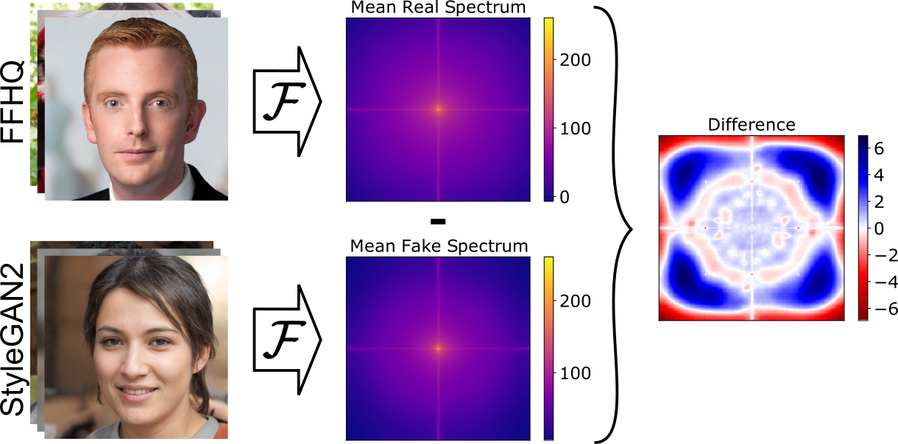
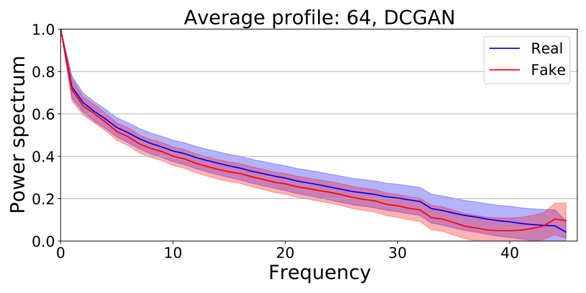
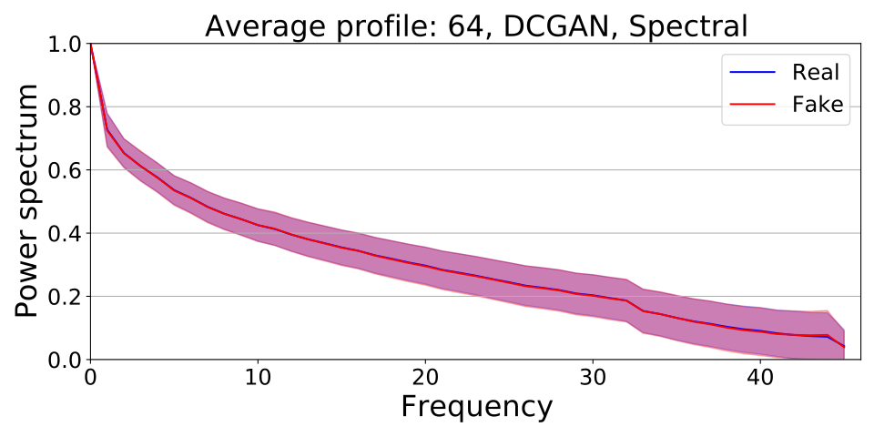

# SpectralGAN: Spectral Distribution Aware Image Generation
* Authors: Steffen Jung and Margret Keuper
* Paper: https://arxiv.org/abs/2012.03110
* Code to train/finetune StyleGAN2: https://github.com/steffen-jung/SpectralGAN-StyleGAN2

# Motivation
Commonly used Generative Adversarial Networks (GANs) are not able to learn the distribution of real datasets in the frequency domain.


Our method adds an additional discriminator increasing the spectral fidelity.
## Spectral fidelity without our method


## Spectral fidelity with out method


# Requirements
Tested on:
* python 3.8.3
* cudatoolkit 10.1.243
* imageio 2.8.0
* imageio-ffmpeg 0.4.2
* matplotlib 3.2.2
* numpy 1.18.5
* pytorch 1.5.1
* torchvision 0.6.1
* tqdm 4.46.1

# Usage Example

Train a new model:
```
python Training.py \
   --device cuda:0 \
   --name Debugging \
   --experiments_folder /path/to/folder \
   --data_folder /path/to/data_folder \
   --epochs 100 \
   --img_size 64 \
   --img_nc 3 \
   --loss lsgan \
   --d_spectral linear
```

Continue training:
```
python Training.py \
   --device cuda:0 \
   --data_folder /path/to/data_folder \
   --epochs 50 \
   --img_size 64 \
   --img_nc 3 \
   --loss lsgan \
   --d_spectral linear \
   --checkpoint /path/to/previous/runfolder
```

# Citation
```
@inproceedings{Jung2021SpectralGAN,
   title     = {Spectral Distribution Aware Image Generation},
   author    = {Steffen Jung and Margret Keuper},
   booktitle = {Thirty-Fifth AAAI Conference on Artificial Intelligence},
   year      = {2021}
}
```

# References
* FID score for PyTorch: https://github.com/mseitzer/pytorch-fid
